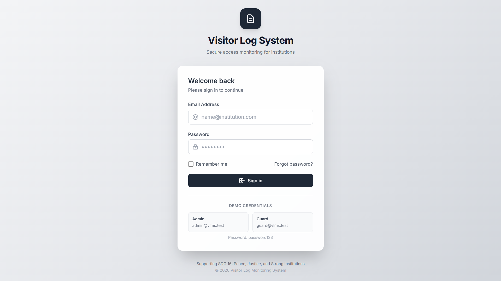
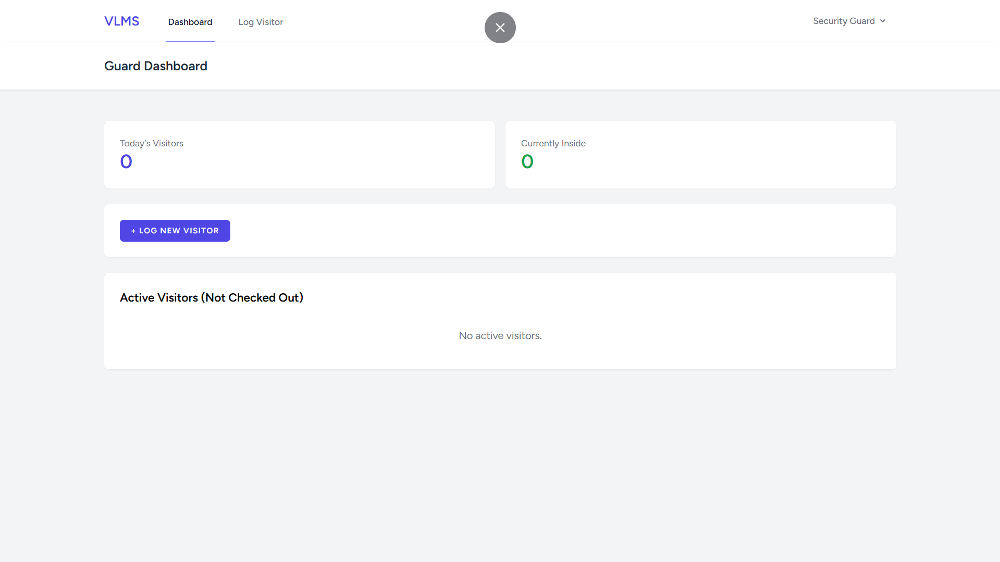
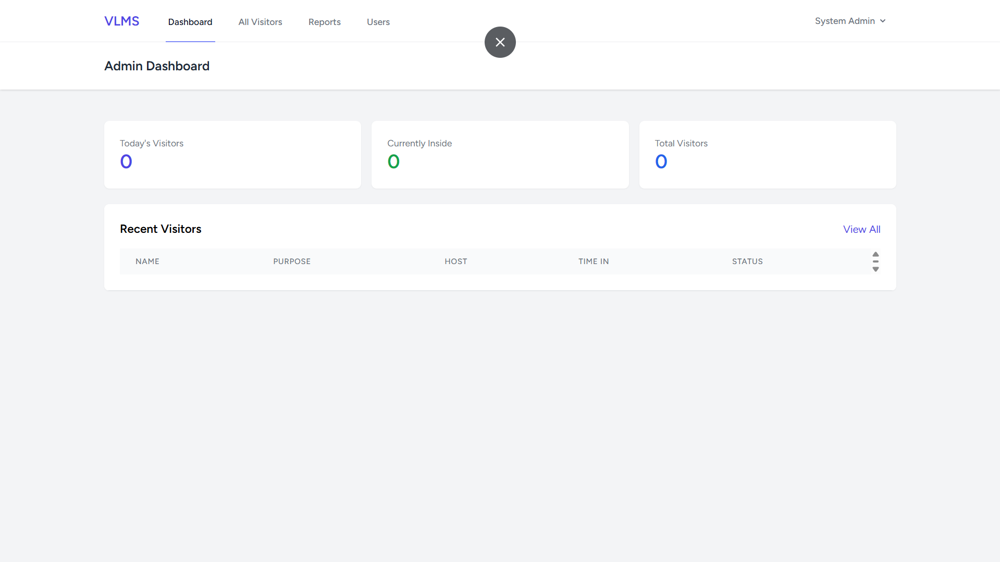
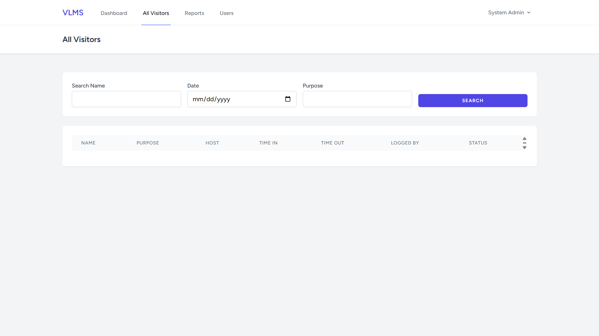
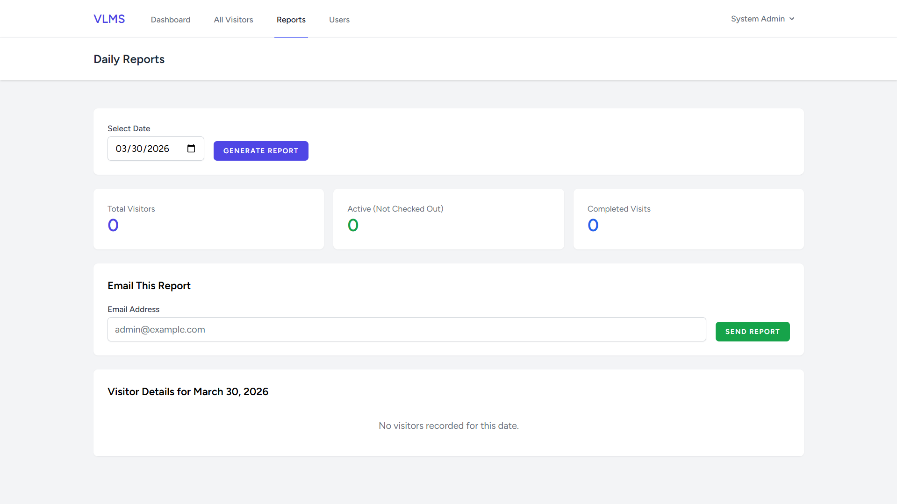
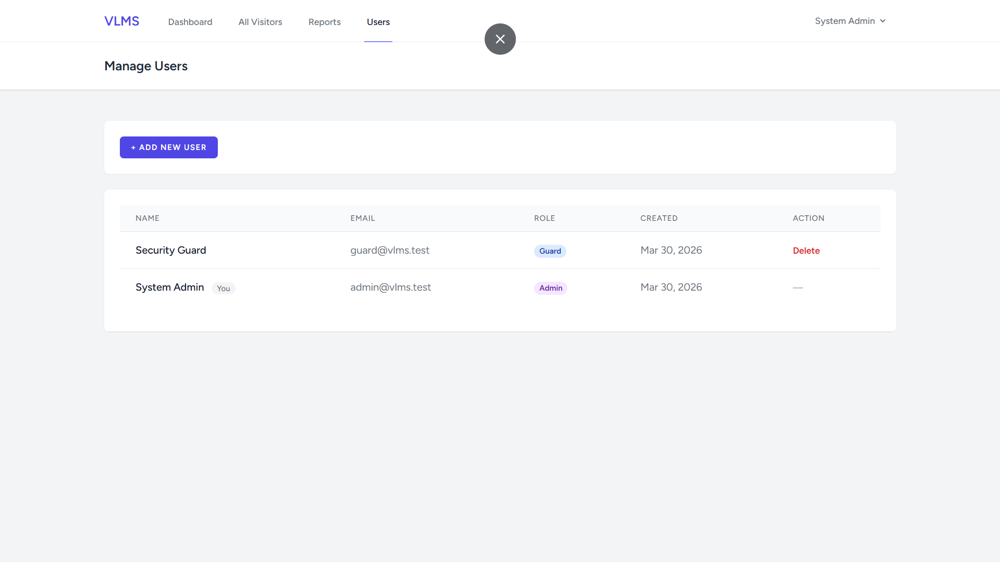

# Visitor-Log-System

Midterm Project

# 📋 Visitor Log Monitoring System (VLMS)

> A web-based visitor management system aligned with **SDG 16: Peace, Justice, and Strong Institutions**


---

## 📌 Project Overview

### The Problem

Many institutions — schools, government offices, and barangay halls — still rely on **paper-based logbooks** to track visitor entries and exits. This leads to:

- Illegible handwriting and lost records
- No real-time visibility of who is inside the premises
- Difficulty generating reports for accountability and auditing
- Security risks due to unmonitored access

### The Solution

VLMS is a digital visitor log system that allows **security guards** to check visitors in/out and **administrators** to monitor, search, and generate reports — supporting transparency and institutional accountability.

### SDG Alignment

**SDG 16 — Peace, Justice, and Strong Institutions**

> _"Promote peaceful and inclusive societies, provide access to justice for all, and build effective, accountable, and inclusive institutions at all levels."_

VLMS directly supports this goal by strengthening institutional security, ensuring accountability in visitor access, and enabling data-driven decision-making through digital records.

---

## 🛠️ Tech Stack

| Layer             | Technology                     |
| ----------------- | ------------------------------ |
| Backend Framework | Laravel 12 (PHP 8.2)           |
| Frontend          | Blade Templates + Tailwind CSS |
| Database          | MySQL 8.0                      |
| Authentication    | Laravel Breeze                 |
| Email             | Laravel Mail (SMTP / Gmail)    |
| Local Server      | XAMPP (Apache + MySQL)         |
| Package Manager   | Composer + NPM                 |

---

## 📁 Repository Structure

```
visitor-log-system/
├── /docs                   # Diagrams and documentation
│   ├── erd.png             # Entity Relationship Diagram
│   ├── use-case.png        # Use Case Diagram
│   ├── system-flow.png     # System Flow Diagram
│   └── screenshots/        # UI screenshots
│       ├── login.png
│       ├── guard-dashboard.png
│       ├── admin-dashboard.png
│       ├── visitor-log.png
│       ├── reports.png
│       └── user-management.png
├── /src                    # Laravel source code
│   ├── app/
│   ├── database/
│   ├── resources/
│   ├── routes/
│   └── ...
├── .env.example            # Environment variable template
├── README.md               # This file
└── ...
```

---

## ⚙️ How to Install and Run

### Prerequisites

- PHP 8.2+
- Composer
- Node.js + NPM
- MySQL 8.0+
- XAMPP (or any local server)

### Step 1 — Clone the Repository

```bash
git clone https://github.com/razonkielandrayzeus-dev/Visitor-Log-System.git
cd visitor-log-system
```

### Step 2 — Install Dependencies

```bash
composer install
npm install
```

### Step 3 — Configure Environment

```bash
cp .env.example .env
php artisan key:generate
```

Then edit `.env` with your database credentials:

```env
DB_CONNECTION=mysql
DB_HOST=127.0.0.1
DB_PORT=3306
DB_DATABASE=visitor_log_db
DB_USERNAME=root
DB_PASSWORD=
```

### Step 4 — Run Migrations and Seed

```bash
php artisan migrate --seed
```

### Step 5 — Build Assets

```bash
npm run build
```

### Step 6 — Start the Server

```bash
php artisan serve
```

Visit: **http://127.0.0.1:8000**

---

## 🔐 Sample Credentials

> ⚠️ These are for **demo/testing purposes only**. Change passwords before deploying to production.

| Role  | Email           | Password               |
| ----- | --------------- | ---------------------- |
| Admin | admin@vlms.test | _(set during seeding)_ |
| Guard | guard@vlms.test | _(set during seeding)_ |

To create your own accounts after seeding, log in as Admin and go to **Users → Add New User**.

---

## 🖼️ Screenshots

### Login Page



### Guard Dashboard



### Admin Dashboard



### Log Visitor (Check-in Form)



### Daily Reports



### User Management



---

## ✨ Features

### Guard Role

- ✅ Check-in new visitors (name, purpose, person to visit)
- ✅ Check-out active visitors
- ✅ View real-time list of visitors currently inside
- ✅ See today's visitor count

### Admin Role

- ✅ View all visitor records with search and filter
- ✅ Generate daily reports by date
- ✅ Send email reports to any address
- ✅ Manage user accounts (create, delete)
- ✅ View dashboard statistics

---

## 🗄️ Database Schema

### `users` table

| Column     | Type      | Description           |
| ---------- | --------- | --------------------- |
| id         | bigint    | Primary key           |
| name       | varchar   | Full name             |
| email      | varchar   | Unique email          |
| password   | varchar   | Hashed password       |
| role       | enum      | `admin` or `guard`    |
| created_at | timestamp | Account creation date |

### `visitors` table

| Column     | Type        | Description                |
| ---------- | ----------- | -------------------------- |
| id         | bigint      | Primary key                |
| full_name  | varchar     | Visitor's full name        |
| purpose    | varchar     | Reason for visit           |
| host_name  | varchar     | Person being visited       |
| time_in    | timestamp   | Check-in time              |
| time_out   | timestamp   | Check-out time (nullable)  |
| logged_by  | bigint (FK) | Guard who logged the entry |
| created_at | timestamp   | Record creation time       |

---

## 📄 License

This project is developed for academic purposes under the MIT License.

---

## 👨‍💻 Developed By

\*_Group name: _
BS Information Technology
University of Cebu LApu-lapu Mandaue
BSIT - 3H

> _"Technology in service of transparency and accountability."_
